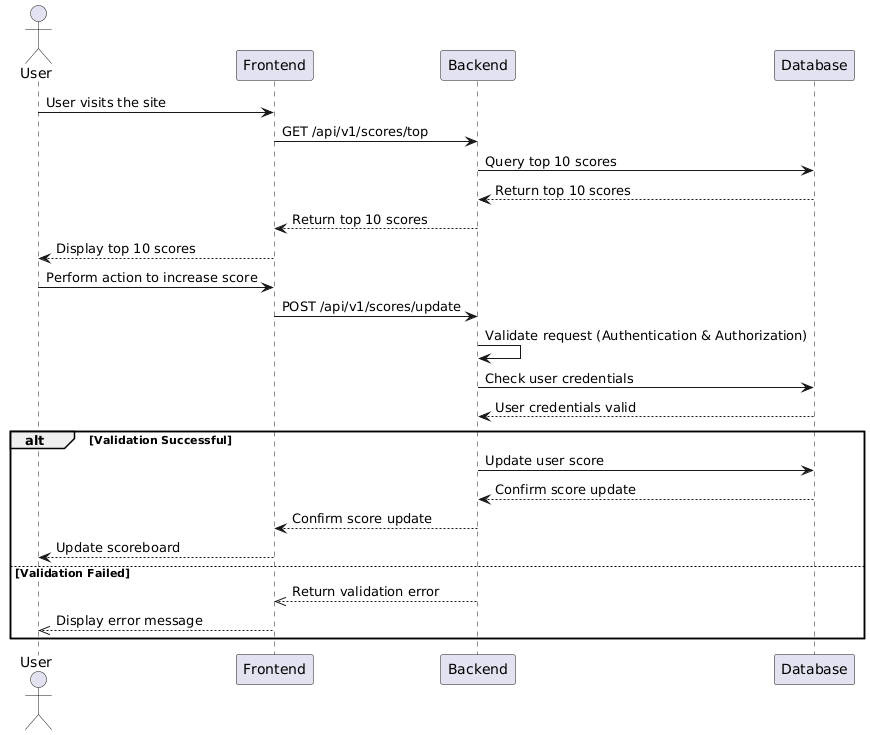

# API Service Module Specification

## Overview

This module handles the backend operations for a scoreboard that displays the top 10 user scores. The system updates scores based on user actions and ensures that only authorized updates are applied to prevent malicious behavior.

## Software Requirements

1. We have a website with a score board, which shows the top 10 user’s scores.
2. We want live update of the score board.
3. User can do an action (which we do not need to care what the action is), completing this action will increase the user’s score.
4. Upon completion the action will dispatch an API call to the application server to update the score.
5. We want to prevent malicious users from increasing scores without authorisation.


## API Endpoints

### 1. Website with a Scoreboard

GET /api/v1/scores/top

| Retrieve the top 10 user scores.

Response:
```json
{
  "scores": [
    {
      "userId": "integer",
      "score": "integer"
    },
    ...
  ]
}
```

### 2. Update Score
POST /api/v1/scores/update

| Update score

Response:
```json
{
  "userId": "integer",
  "score": "integer"
},
```

## Authorization
To prevent unauthorized score increases, ensure that each request to update the score includes a valid token in the Authorization header. The backend should validate this token before updating the score.

##  Flow of Execution

1. The user visits the frontend, which sends a GET request to `/api/v1/scores/top` to retrieve and display the top 10 scores.
1. User completes an action on the frontend.
1. Frontend sends a POST request to `/api/v1/scores/update` with the user's ID and the action performed.
1. The backend validates the authorization token in the request header.
1. If the token is valid, the backend updates the user's score based on the action.
1. The backend sends a response indicating the success of the score update.


## Diagram of Execution Flow



## Additional comments for improvement

1. Rate Limiting: Implement rate limiting on the `/api/v1/scores/update` endpoint to prevent abuse and ensure fair usage.
2. Logging: Implement logging for all score update requests and responses. This will help in monitoring and debugging issues.
3. Security: Validate all inputs to prevent SQL injection and other common attacks.